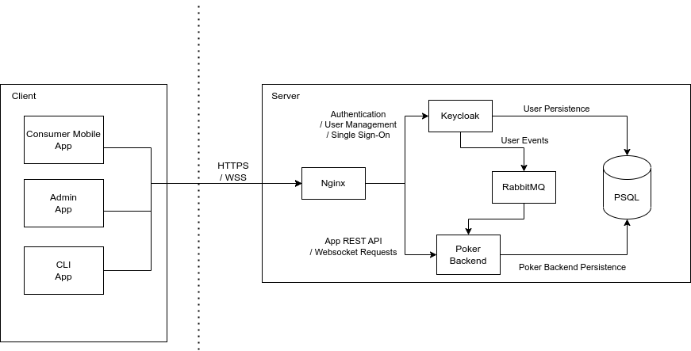

# Poker App

[](https://github.com/thomasbigger584/poker-app/actions/workflows/android.yml)
[](https://github.com/thomasbigger584/poker-app/actions/workflows/api.yml)


## Server Usage

- Use the python bootstrap scripts to [run the application locally](bootstrap/README.md)

## Client Usage

### Android Studio

- To run the Android App, install Android Studio and open the folder `client/android` as a project.
- Once everything syncs and builds you can run it on your device.

### CLI (Mac)

- Add the android tools to your PATH. Installed via Android Studio or separately

```shell
export ANDROID_HOME=/Users/<username>/Library/Android/sdk
export PATH=$PATH:$ANDROID_HOME/platform-tools
export PATH=$PATH:$ANDROID_HOME/tools
export PATH=$PATH:$ANDROID_HOME/tools/bin
```

### CLI (Linux)

```shell
sudo apt install adb
```

- Run the following command from root directory to run app to all connected android devices.
- Useful to test multiple users at once with latest changes

```shell
./android_run.sh
```

### Windows

- Currently WSL2 doesnt support Android Studio, so id just recommend everything to run natively with windows.
- Install Genymotion Android Emulator and setup 2 VMs to run multiple instances of the app.

## Architecture



#### Consumer Mobile App

- The mobile application designed for regular users to interact with the games.
- It will connect to keycloak for authentication and then once logged in can access tables and connect to a table via
  websocket, and take part in the game.
- Once it subscripts to a websocket, receiving updates from the server in realtime of any updates which happen on the
  table and update the UI accordingly.

#### Admin App

- An angular/react application which is used for Administrators to create new tables and view users etc.
- Can be very basic for now but I would want this in place to make configuration easier once the application is
  deployed.

#### CLI App

- A CLI application used primarily for test purpose to listen to websocket messages.
- The user will log in as a listener user, and will select a Table ID and receive all messages on that table.

#### Nginx

- A reverse proxy used to forward requests from the outside towards their respective internal services.
- Will also be used to handle SSL, and later down the line, handle load balancing.

#### Keycloak

- A service used to handle users, roles, authentication and Single Sign-On (SSO).
- Any events that happen in Keycloak will get published onto a Rabbit MQ queue to be consumed by the java application to
  handle user signup.

#### Poker Backend

- A Java Spring Boot application to handle all application business logic.
- It will subscribe to the RabbitMQ keycloak topic to get user related events.
- It will expose the REST API to handle creating tables and game management.
- It will expose a websocket for clients to connect to while playing the game to receive updates in real time for
  updating their UI.

#### Rabbit MQ

- A message broker used to publish events within the application.
- Currently used as the backing technology for websockets and also for keycloak to backend app user events.
- Can be used for any other eventing later.

#### PostgresQL (PSQL)

- The database of choice for storing both the keycloak persistence data and backend app persistence data.
